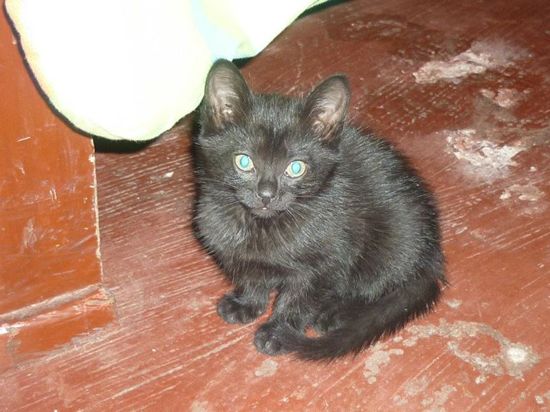
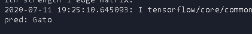
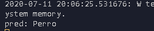
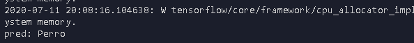

# Clasificador-de-perros-y-gatos

 
  
  
 
   
   
  
     

# Requisitos

* Tener la versión 3.6 de python
* Keras
* TensorFlow
* matplotlib
* numpy

# Antes de usar
* Crear carpeta llamada Modelo
* Crear carpeta llamada data que contenga las carpetas Entrenamiento y Validacion .
* Dentro de la carpeta Entrenamiento crear dos carpetas una llamada Gatos y otra Perros ,en cada una colocar las imagenes correspondientes a la especie
* Dentro de la carpeta Validacion crear dos carpetas una llamada Gatos y otra Perros ,en cada una colocar las imagenes correspondientes a la especie

# Entrenar
Ejecuta el comando python entrenar.py

# Predecir
* Para que te funcione debes previamente entrenar ,de lo contrario no te va o fucionar ,ya que al entrenar se genera el  odelo y los pesos para que la red sepa diferenciar que es un gato y un perro .

* Por determinado coloque como imagenes de prueba : prueba.jpg ,prueba2.jpg , prueba2.jpg .Si deseas predercir con otras imagenes solo añade "predict('NombreArchivo.jpg')"
(si deseas puedes usar el modelo y pesos que genero mi entrenamiento ,cuando lo descarges lo guardas en la carpeta Modelo)

* Modelo :https://www.mediafire.com/file/8l2q4o8yoiqyfpb/pesos.h5/file
* Pesos : https://www.mediafire.com/file/4sq8tlb6knjl5zj/modelo.h5/file
